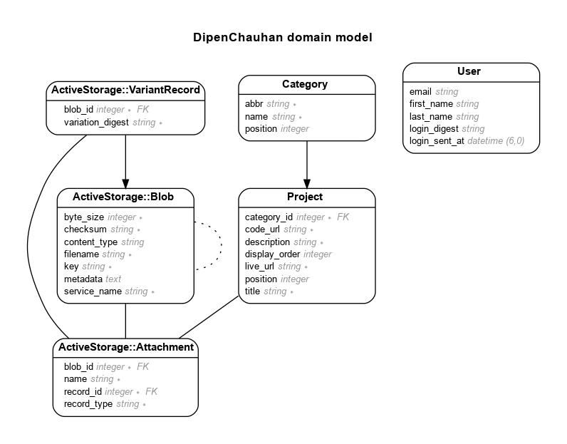

# My Personal Portfolio Website

This is the code for my portfolio website: https://www.dipenchauhan.com


Live - https://dipenchauhan.com

# Features

- Add/remove projects with images
- Single user sign in
- Projects' display order can be changed
- Add/remove project categories
- Categories display order can be changed

# Model

Generated by Rails ERD. Run rails erd to regenerate (must have graphviz).


## Version

- ruby 3.1.2
- Rails 7.0.4

## Standard Steps in all my apps

- Create new app

  ```sh
  rails new myapp --database=postgresql
  ```

- Add Gems:

  - Gemfile

  ```rb
  gem "sassc-rails"
  gem "image_processing", "~> 1.2"
  gem "devise"


  # In development group:
  gem "rails-erd"
  gem "chusaku", require: false
  gem "annotate"
  gem "faker"
  # Preview email in the default browser instead of sending it.
  gem "letter_opener"
  # Format ERB Files
  gem "erb-formatter"
  ```

  - In Development Mode, prevent installation of production gems
    ```sh
    $ bundle config set --local without 'production'
    $ bundle install
    $ bundle lock --add-platform x86_64-linux
    ```

- Rails ERD (Entity Relationship Diagram)

  - Add .erdconfig file:

  ```sh
  echo "attributes: content,foreign_key" > .erdconfig
  echo "filetype: png" >> .erdconfig
  ```

  - Install:

  ```sh
  bundle exec rails g erd:install
  ```

- Annotate Models and Routes file
  - Create routes.rake file:
  ```sh
  curl -LJ --output lib/tasks/routes.rake https://github.com/overdrivemachines/dipen_chauhan/raw/master/lib/tasks/routes.rake
  ```
  - Install:
  ```sh
  rails g annotate:install
  ```
- Add Bootstrap: https://dev.to/overdrivemachines/add-bootstrap-5-and-font-awesome-6-to-rails-7-31b3
- Add edit_credentials.sh
  ```sh
  echo "EDITOR="code --wait" rails credentials:edit" > edit_credentials.sh
  chmod +x edit_credentials.sh
  ```
- PostgreSQL Database

  - Install:
    ```
    sudo apt update
    sudo apt install postgresql postgresql-contrib libpq-d
    ```
  - Create New Role
    ```sh
    sudo -u postgres createuser --interactive
    ```
    Output
    ```
    Enter name of role to add: dipen
    Shall the new role be a superuser? (y/n) y
    ```
  - Create New Database
    ```sh
    sudo -u postgres createdb dipen
    ```
  - Commands
    ```
    psql
    \l - List databases
    \du - List roles
    \q - quit
    ```
  - In database.yml add
    ```yml
    development:
      username: dipen
      password: <%= Rails.application.credentials.dig(Rails.env.to_sym, :pg_password) %>
    test:
      username: dipen
      password: <%= Rails.application.credentials.dig(Rails.env.to_sym, :pg_password) %>
    production:
      username: deploy
      password: <%= Rails.application.credentials.dig(Rails.env.to_sym, :pg_password) %>
    ```
  - Save passwords in credentials file by running ./edit_credentials.sh
    ```yml
    development:
      pg_password: password_for_role_dipen
    test:
      pg_password: password_for_role_dipen
    production:
      pg_password: password_for_role_deploy
    ```
  - Create DB
    ```sh
    rails db:create
    ```

- Emails

  - Go to https://myaccount.google.com/apppasswords and create a new app password
  - Save password in rails credentials (./edit_credentials.sh)
    ```yml
    gmail:
      email: a@gmail.com
      password: app password from previous step
    ```
  - In development.rb add:

    ```rb
    host = "localhost:3000"
    config.action_mailer.default_url_options = { host:, protocol: 'http' }

    # letter_opener gem configuration: https://github.com/ryanb/letter_opener
    # Now any email will pop up in your browser instead of being sent.
    config.action_mailer.delivery_method = :letter_opener
    config.action_mailer.perform_deliveries = true
    ```

  - In production.rb add:

    ```rb
    config.action_mailer.delivery_method = :smtp
    config.action_mailer.default_url_options = { host: "dipenchauhan.com" }

    # SMTP settings for gmail
    config.action_mailer.smtp_settings = {
      address: "smtp.gmail.com",
      port: 587,
      user_name: Rails.application.credentials.dig(:gmail, :email),
      password: Rails.application.credentials.dig(:gmail, :password),
      authentication: "plain",
      enable_starttls_auto: true
    }
    ```

## Deployment Instructions

- Login to server with deploy user `ssh deploy@y*r.com`
- Download repository from Github
  ```sh
  cd /var/www
  sudo mkdir myapp
  sudo chown deploy:deploy myapp
  cd myapp
  git clone git@github.com:overdrivemachines/myapp.git code
  cd code
  ```
- Install App Dependencies on Production
  ```sh
  bundle config set --local deployment 'true'
  bundle config set --local without 'development test'
  bundle install
  ```
- PostgreSQL Database

  - Install PostgreSQL
    ```sh
    sudo apt update
    sudo apt install postgresql postgresql-contrib
    ```
  - Add User/Role and Database. The name must be the same as your username in Ubuntu. For production it will be deploy. If deploy User/Role already exits, skip this step
    ```sh
    sudo -u postgres createuser -s deploy -P
    sudo -u postgres createdb deploy
    ```
    -s = Add the superuser privilege<br>
    -P = Password creation prompt
  - Create DB
    ```sh
    RAILS_ENV=production rails db:create
    RAILS_ENV=production bundle exec rake assets:precompile db:migrate
    sudo service nginx reload
    ```

- NGINX

  - Add Configuration file to `/etc/nginx/sites-enabled/myapp`

    ```
    server {
        listen 80;
        server_name dipenchauhan.com www.dipenchauhan.com;

        # Tell Nginx and Passenger where your app's 'public' directory is
        root /var/www/dipen_chauhan/code/public;

        # Max file size of uploads
        client_max_body_size 10M;

        # Turn on Passenger
        passenger_enabled on;
        passenger_ruby /home/deploy/.rvm/rubies/ruby-3.1.2/bin/ruby;
    }
    ```

  - Restart
    ```sh
    sudo service nginx restart
    passenger-config restart-app
    ```
  - Test Configuration
    ```sh
    sudo nginx -t
    ```

- SSL Certificate Installation

  ```sh
  sudo certbot --nginx -d dipenchauhan.com -d www.dipenchauhan.com
  ```

- Updates
  ```sh
  cd /var/www/myapp/code
  git pull
  bundle config set --local deployment 'true'
  bundle config set --local without 'development test'
  bundle exec rake assets:precompile db:migrate RAILS_ENV=production
  passenger-config restart-app $(pwd)
  ```

## What I Learned

- Add Custom Fonts to `vendor/assets/fonts`. The path is automatically added to `Rails.application.config.assets.paths`. Verify in Rails Console.

## Authentication

- when a user logs in, make a 'remember me' cookie with a long expiration date
- if there is a session cookie, use that
- if not, check if we have a remember-me cookie
  - if so, check if that value is valid (not tampered with)
    - if so, look up that user, and set a new session cookie

## References

- Add Custom Fonts
  https://www.karinabaha.com/posts/custom-fonts-in-ruby-on-rails-7
- Deploy Rails App:
  - https://www.phusionpassenger.com/library/walkthroughs/deploy/ruby/digital_ocean/nginx/oss/bionic/deploy_app.html
  - New: https://www.phusionpassenger.com/docs/tutorials/deploy_to_production/deploying_your_app/oss/digital_ocean/ruby/nginx/
- Troubleshooting NGINX: https://www.phusionpassenger.com/library/admin/nginx/troubleshooting/ruby/
- Inspiration
  - https://preview.themeforest.net/item/ober-cv-resume-react-template/full_screen_preview/40317292
  - https://creazione.avanzare.co/reframe/demo/index.html?bg=square
  - https://themeforest.net/item/reframe-personal-one-page-portfolio-html-template/33840600
  - https://harnishdesign.net/demo/html/simone/index-dark-classic-header.html
  - https://themes.muffingroup.com/be/code2/ <---
  - New Theme
    - https://demo.egenslab.com/html/picszen/preview/index.html
    - https://preview.themeforest.net/item/picszen-photography-html-template/full_screen_preview/42275106
- Add pictures in Rails: https://www.youtube.com/watch?v=1cw6qO1EYGw
- Nav bar active css - https://gist.github.com/mynameispj/5692162
- Bootstrap 5 in Rails 7 - https://blog.eq8.eu/til/how-to-use-bootstrap-5-in-rails-7.html
- Ordering
  - Order attachments - https://blog.eq8.eu/article/order-attachments-in-rails-activestorage-has_many_attached.html
- Add Categories
  - rails g migration AddCategoryToProjects category:belongs_to
  - https://www.youtube.com/watch?v=XCi1htTx9vY
- Mail form
  - https://www.railscoder.com/articles/adding-contact-forms-in-rails-7-with-mail_form-gem
  - https://gist.github.com/stevecondylios/16a53b73f22621e3cde2e17096dbf5ca
  - https://mailtrap.io/blog/ruby-on-rails-contact-form/
  - https://medium.com/@Gabriel.Valle/rails-and-mail-form-f4bc4f991c83
- Save sorted list in DB: https://github.com/brendon/acts_as_list
