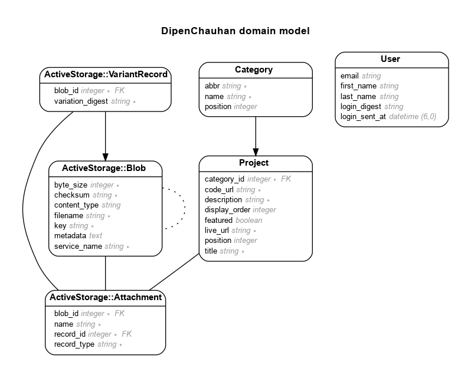

# My Personal Portfolio Website

This is the code for my portfolio website: https://www.dipenchauhan.com


Live - https://dipenchauhan.com

# TODO

- Add/remove projects with images
- Sign in single user
- Auto add projects from my github
- Project Display Order

# Model

Generated by Rails ERD. Run rails erd to regenerate (must have graphviz).


## Version

- ruby 3.1.2
- Rails 7.0.4

## Setup Instructions

- Install PostgreSQL

```sh
sudo apt update
sudo apt install postgresql postgresql-contrib libpq-dev
```

- In Development Mode, prevent installation of production gems

```sh
$ bundle config set --local without 'production'
$ bundle install
$ bundle lock --add-platform x86_64-linux
```

## Deployment instructions

- Add User/Role and Database. The name must be the same as your username in Ubuntu. For production it will be deploy. If deploy User/Role already exits, skip this step

```sh
sudo -u postgres createuser -s deploy -P
sudo -u postgres createdb deploy
```

-s = Add the superuser privilege<br>
-P = Password creation prompt

- Install App Dependencies on Production

```sh
bundle config set --local deployment 'true'
bundle config set --local without 'development test'
bundle install
```

- Create DB on Production

```sh
RAILS_ENV=production rails db:create
RAILS_ENV=production bundle exec rake assets:precompile db:migrate
sudo service nginx reload
```

- View DB exists:

```sh
psql
\l
```

\l - list all databases
\q - quit

- Add NGINX Configuration file

```sh
sudo nano /etc/nginx/sites-enabled/dipen_chauhan.conf
```

```
server {
    listen 80;
    server_name dipenchauhan.com;

    # Tell Nginx and Passenger where your app's 'public' directory is
    root /home/deploy/www/dipen_chauhan/code/public;

    # Turn on Passenger
    passenger_enabled on;
    passenger_ruby /home/deploy/.rvm/rubies/ruby-3.1.2/bin/ruby;
}
```

Restart NGINX

```
sudo service nginx reload
passenger-config restart-app
```

## What I Learned

- Add Custom Fonts to `vendor/assets/fonts`. The path is automatically added to `Rails.application.config.assets.paths`. Verify in Rails Console.

## Authentication

- when a user logs in, make a 'remember me' cookie with a long expiration date
- if there is a session cookie, use that
- if not, check if we have a remember-me cookie
  - if so, check if that value is valid (not tampered with)
    - if so, look up that user, and set a new session cookie

## References

- Add Custom Fonts
  https://www.karinabaha.com/posts/custom-fonts-in-ruby-on-rails-7
- Deploy Rails App:
  - https://www.phusionpassenger.com/library/walkthroughs/deploy/ruby/digital_ocean/nginx/oss/bionic/deploy_app.html
  - New: https://www.phusionpassenger.com/docs/tutorials/deploy_to_production/deploying_your_app/oss/digital_ocean/ruby/nginx/
- Troubleshooting NGINX: https://www.phusionpassenger.com/library/admin/nginx/troubleshooting/ruby/
- Inspiration
  - https://preview.themeforest.net/item/ober-cv-resume-react-template/full_screen_preview/40317292
  - https://creazione.avanzare.co/reframe/demo/index.html?bg=square
  - https://themeforest.net/item/reframe-personal-one-page-portfolio-html-template/33840600
  - https://harnishdesign.net/demo/html/simone/index-dark-classic-header.html
  - https://themes.muffingroup.com/be/code2/ <---
- Add pictures in Rails: https://www.youtube.com/watch?v=1cw6qO1EYGw
- Nav bar active css - https://gist.github.com/mynameispj/5692162
- Bootstrap 5 in Rails 7 - https://blog.eq8.eu/til/how-to-use-bootstrap-5-in-rails-7.html
- Ordering
  - Order attachments - https://blog.eq8.eu/article/order-attachments-in-rails-activestorage-has_many_attached.html
- Add Categories
  - rails g migration AddCategoryToProjects category:belongs_to
  - https://www.youtube.com/watch?v=XCi1htTx9vY
